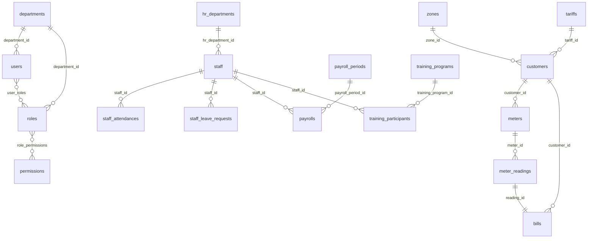

# AquaBill — Database documentation

**Source of truth:** `database/migrations/*.php` in this repository.  
**RDBMS:** MySQL is typical for production; local `.env.example` uses SQLite — both work with Laravel’s schema builder.

---

## Conventions

- **Foreign keys** use `constrained()` with `onDelete` / `cascade` / `restrict` / `nullOnDelete` as defined per migration.
- **Indexes** are listed explicitly where created in migrations.
- **Soft deletes** where `$table->softDeletes()` appears (`hr_departments`, `staff`, `training_programs`, `payrolls`, `staff_documents`).

---

## Tables summary

### Authentication & sessions

| Table | Purpose |
|-------|---------|
| `users` | `name`, `email`, `password`, `remember_token`, `email_verified_at`, plus `department_id`, `status`, `last_login_at`. |
| `password_reset_tokens` | Laravel default. |
| `sessions` | Session driver storage (`user_id`, `payload`, …). |
| `personal_access_tokens` | Sanctum API tokens. |

### Organisation & RBAC

| Table | Key columns / notes |
|-------|---------------------|
| `departments` | `name` (unique), `description` — values like `admin`, `finance`, `ledger`, `hr`, `customer_care`. |
| `roles` | `name`, `department_id` → `departments`. |
| `permissions` | `name` (unique). |
| `role_permissions` | `role_id`, `permission_id`, unique pair. |
| `user_roles` | `user_id`, `role_id`, unique pair. |

### Billing core

| Table | Key columns / notes |
|-------|---------------------|
| `zones` | `name` (unique), `supply_day`, `supply_time`, `description`, `status`. |
| `subzones` | `zone_id`, `name`, unique (`zone_id`,`name`). |
| `tariffs` | `name`, `price_per_unit`, `fixed_charge`. |
| `tariff_histories` | Snapshot: `tariff_id`, `name`, `price_per_unit`, `fixed_charge`, `description`, `created_by`. |
| `customers` | `account_number` (unique), `customer_type`, `name`, `phone`, `email`, `national_id`, `plot_no`, `address`, `zone_id`, `tariff_id`, `connection_date`, `last_reading_date`, `status`. |
| `meters` | `customer_id`, `meter_number` (unique), `last_reading`, `status`. |
| `meter_readings` | `meter_number`, `meter_id`, `reading_date`, `previous_reading`, `current_reading`, `consumption`, `image`, `recorded_by`, `notes`, `is_initial`; later: `customer_id`, `bill_no`. |
| `meter_history` | Meter replacement history (`meter_id`, `customer_id`, readings, `replaced_by`, …). |
| `bills` | `bill_no` (unique), `customer_id`, `meter_number`, `meter_id`, `reading_id` (unique), monetary columns, `status` enum, `due_date`. |
| `disconnections` | Customer disconnection workflow and audit fields. |
| `service_charge_types` | `name`, `code` (unique), `amount`, `description`. |
| `service_charges` | `customer_id`, `bill_id`, `service_charge_type_id`, `amount`, `issued_by`, `issued_date`, `due_date`, `status`, `notes`. |

### HR & training

| Table | Key columns / notes |
|-------|---------------------|
| `hr_departments` | Internal HR org units: `name`, `code` (unique), `is_active`, soft deletes. |
| `staff` | `hr_department_id`, `employee_number`, personal/bank fields, `status`, soft deletes. |
| `leave_types` | `name`, `default_days_per_year`, `is_paid`, `is_active`. |
| `document_types` | `name`, `is_required`. |
| `staff_attendances` | Unique (`staff_id`,`attendance_date`), clock times, `status`, minutes. |
| `staff_leave_requests` | `staff_id`, `leave_type_id`, dates, `total_days`, `status`, approval fields → `users`. |
| `staff_leave_balances` | Per year: entitled/used/remaining days; unique (`staff_id`,`leave_type_id`,`year`). |
| `payroll_periods` | `name`, `start_date`, `end_date`, `status`. |
| `staff_salaries` | Salary structure versions per staff (`effective_from`). |
| `payrolls` | Per period/staff pay lines; soft deletes; unique (`payroll_period_id`,`staff_id`). |
| `payroll_adjustments` | `payroll_id`, `type` bonus/deduction, `amount`, `title`. |
| `staff_documents` | File metadata, `expires_at` index; soft deletes. |
| `training_programs` | `title`, dates, `cost`, `status`; soft deletes. |
| `training_participants` | Unique (`training_program_id`,`staff_id`), `status`, `score`, `certificate_path`. |
| `training_documents` | `training_program_id`, `file_path`, `title`. |

### Laravel framework defaults

| Table | Purpose |
|-------|---------|
| `cache`, `cache_locks` | Database cache store. |
| `jobs`, `job_batches`, `failed_jobs` | Queue (if `database` driver). |

---

## Relationships (logical)

- `Customer` → belongs to `Zone`, `Tariff`; has many `Meters`, `Bills`, `ServiceCharges`, `Disconnections`.
- `Meter` → belongs to `Customer`; has many `MeterReading`s; replacement tracked in `meter_history`.
- `MeterReading` → belongs to `Meter`, `Customer`, `User` (recorded_by); links to one `Bill` (unique `reading_id` on bills).
- `Bill` → belongs to `Customer`, `MeterReading`; payments update columns on bill (no separate `payments` table in migrations reviewed).
- `User` → belongs to `Department`; many-to-many `Role`s.
- `Staff` → belongs to `HrDepartment`; related attendance, leave, payrolls, documents, training participants.
- `TrainingProgram` → has many participants and documents.

---

## Important constraints

| Constraint | Detail |
|------------|--------|
| `bills.reading_id` | **Unique** — one bill per reading. |
| `bills.bill_no` | **Unique**; model boot may auto-generate `BILL-######` if empty on create. |
| `staff_attendances` | One row per staff per calendar date. |
| `training_participants` | One enrollment per staff per program. |
| `payrolls` | One row per staff per payroll period. |

---

## Suggested ERD (Mermaid)

High-level only; not every column shown.

---

## Needs confirmation

- Production **engine** (InnoDB settings, charset `utf8mb4`).
- Whether **duplicate** `create_bills_table` migration files are consolidated before deploy.

---

## Code vs schema notes

- `BillService` references **`is_default`** and **`status`** on tariffs — **not** in `create_tariffs_table` migration; ensure migrations align or always attach **tariff_id** on customers.
