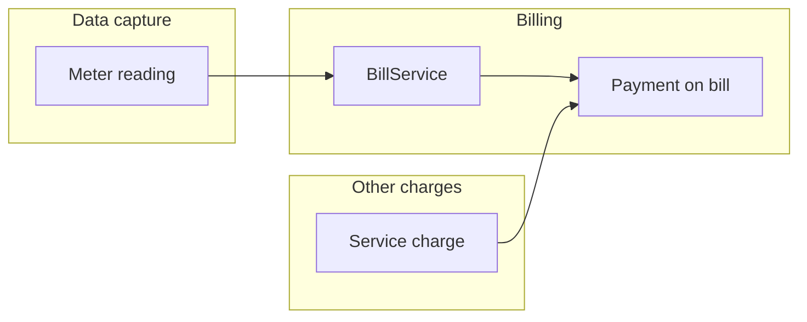

# AquaBill Billing System — System overview

**Product:** AquaBill Billing System  
**Client:** South Sudan Urban Water Corporation (SSUWC)  
**Stack:** Laravel (backend), React + Inertia.js (web UI), MySQL/SQLite-compatible schema, Laravel Sanctum (API tokens), Tailwind CSS.

---

## Introduction

AquaBill supports SSUWC’s core water utility workflows: customer accounts, metering and readings, billing from consumption, payments and service charges, operational reporting, and a growing human-resources area (staff, attendance and leave visibility, payroll structures, documents, and training programs).

The web application routes authenticated users by **organizational department** (administration, finance, ledger/billing, HR, customer care) to the relevant dashboards and navigation.

---

## Objectives

| Objective | How AquaBill supports it |
|-----------|---------------------------|
| Accurate billing | Bills generated from meter readings using tariff snapshots (`BillService`). |
| Revenue visibility | Revenue report with filters; water usage report by zone and customer. |
| Customer lifecycle | Customers linked to zones and tariffs; disconnections and reconnections tracked. |
| Field data capture | REST API for customer listing and meter reading submission (Sanctum). |
| Workforce oversight | HR dashboards, staff profiles, training CRUD, document expiry alerts (partial flows — see below). |

---

## System modules

| Module | Description |
|--------|-------------|
| **Authentication** | Session login/logout, registration (where enabled), password reset, email verification routes; profile and password settings. |
| **Department dashboards** | Redirect from `/dashboard` by user department: Admin, Finance, Ledger, HR, Customer Care; generic dashboard fallback. |
| **Customers** | List/filter, create/edit/show; meters; readings history; bills and payments on profile; service charges; disconnection actions. |
| **Zones & meters** | Zones (with subzones in schema); meters per customer; meter replacement. |
| **Meter readings** | Web CRUD (index/store/show), export; readings drive bill generation. |
| **Tariffs** | List/show for broad roles; create/update/delete restricted to **admin** department. |
| **Bills & payments** | Bill list/show, print and bulk print, overdue list, payment recording on bill. |
| **Service charges** | Charge types (admin), charges per customer, payment confirmation. |
| **Reports** | Revenue; water usage (consumption, zones, top consumers). |
| **HR** | HR departments, staff CRUD (list/create/show), read-only style pages for attendance, leave, payroll periods, expiring staff documents, HR “reports” placeholder, **training** (programs, participants, documents, training reports). |
| **Admin** | User management (admin department), roles page (Inertia), settings placeholder, service charge type management. |
| **API** | Token login/logout, customers index, readings store, service charge types list. |

---

## Key features

- **Department-based access** to department landing pages and HR area (`CheckDepartment` middleware).
- **Bill generation** when a new reading is processed (web or API), including previous balance roll-up and “forwarded” status for prior open bills.
- **Revenue reporting** with date range and customer search; chart and bill table.
- **Water usage reporting** with zone breakdown and top consumers.
- **Training management** (backend + UI): programs, enrollments, documents, filtered training cost report.
- **Sanctum**-protected API for integrated clients (e.g. mobile).

---

## Benefits to SSUWC

- **Single system** for billing data, customer master data, and HR/training records.
- **Traceability** of readings to bills and payments; service charges as a separate stream.
- **Role/permission seed data** for future fine-grained access (see security doc — enforcement is mostly department-based today).
- **Extensible** Laravel + Inertia stack for future modules (e.g. full payroll runs, leave approval workflows).

---

## High-level workflows

1. **Reading to bill:** A reading is saved; a bill is created for the latest unbilled reading, using customer tariff snapshots and prior balances.
2. **Payment:** Staff record a payment on a bill; status updates to partial or paid.
3. **Service charge:** Optional fees (types defined in admin); can be marked paid separately.
4. **Reporting:** Finance and management use revenue and water-usage reports with filters.

---

## Future improvements (recommended)

- **Enforce permission names** from `PermissionSeeder` on routes or policies (currently **not** applied to HTTP routes).
- **Complete HR workflows:** attendance entry, leave request/approve, payroll generation (UI notes “generation flows will attach here”).
- **Align schema and code:** e.g. default tariff query in `BillService` references fields not present on `tariffs` table migration; API returns `user.zone_id` but users table has no `zone_id` column — see technical documentation.
- **Remove or secure** public API test endpoint (`GET /api/test`).
- **Harden navigation:** replace sidebar placeholder links (`#`) with real pages or hide until implemented.

---

## Partially implemented areas (summary)

| Area | Status in codebase |
|------|-------------------|
| HR attendance / leave / payroll | **Read-only / listing UIs**; no matching POST/PATCH routes in `routes/web.php` for recording attendance or approving leave. |
| Permissions | **Seeded** and attached to roles; **not** checked per route (department middleware is primary). |
| Customer Care | Dashboard route exists; “Complaints/Tickets” in sidebar are placeholders. |

For detail, see [TECHNICAL_DOCUMENTATION.md](TECHNICAL_DOCUMENTATION.md) and the **Gaps** section in [README.md](README.md).
