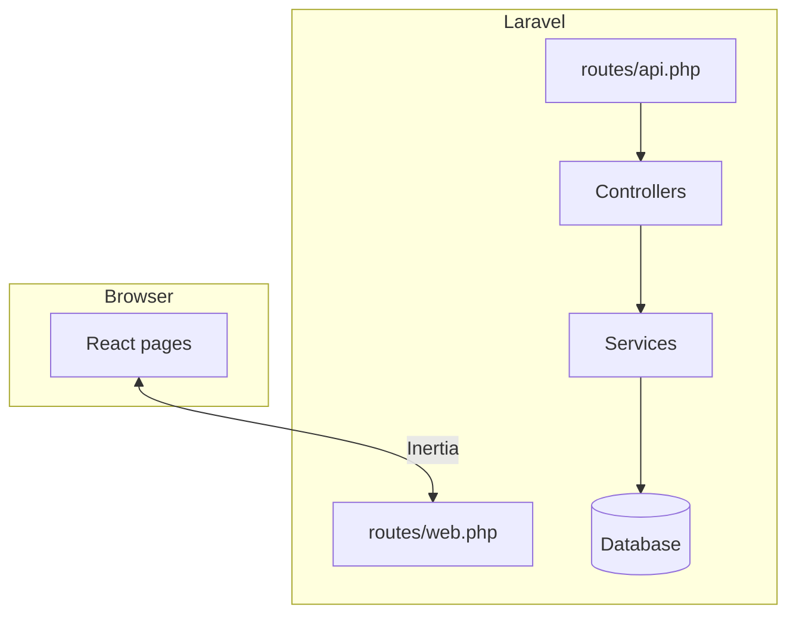

# AquaBill — Technical documentation

**Audience:** Developers and IT staff maintaining the SSUWC deployment.

---

## System architecture

- **Monolith** with **Inertia.js** bridge: Laravel renders React pages, no separate SPA build for API for the main UI.
- **Web:** Session auth (`web` guard), `auth` + `verified` on main app routes; `CheckDepartment` for department-scoped URLs; `Inertia\Middleware\HandleInertiaRequests` shares `auth.user` with `roles` and `department` loaded.
- **API:** Stateless **Sanctum** token auth (`auth:sanctum`) for JSON clients.
- **Build:** Vite + React 19 + Tailwind v4 (per project dependencies).

---

## Folder structure (high level)

| Path | Purpose |
|------|---------|
| `app/Http/Controllers/` | Web + API controllers (including `Departments/`, `HR/`, `Admin/`, `Api/`). |
| `app/Http/Middleware/` | `CheckDepartment`, `RoleMiddleware`, `HandleInertiaRequests`, etc. |
| `app/Http/Requests/` | Form requests for HR/training validation. |
| `app/Models/` | Eloquent models (billing, HR, training, RBAC). |
| `app/Services/` | `BillService`, `TrainingService`, `TrainingReportService`. |
| `database/migrations/` | Schema (see [DATABASE_DOCUMENTATION.md](DATABASE_DOCUMENTATION.md)). |
| `database/seeders/` | Departments, roles, permissions, zones, tariffs, HR seeds, etc. |
| `resources/js/pages/` | Inertia React pages (mirror route names: `bills/`, `customers/`, `hr/`, …). |
| `resources/js/components/` | Shared UI (sidebar, modals, tables). |
| `routes/web.php` | Primary application routes. |
| `routes/api.php` | Sanctum API. |
| `routes/auth.php` | Login, register, password reset, verification. |
| `routes/settings.php` | Profile and password settings. |
| `bootstrap/app.php` | Middleware aliases (`department`, `role`), routing registration. |

---

## Backend structure

### Routing conventions

- **Resource** routes used where Laravel conventions apply (`customers`, `bills` limited actions, `meters`, `readings`, `service-charges`, `training/programs` under `hr` prefix).
- **Department gate:** `middleware('department:admin|finance|hr|...')` compares `user.department.name` to a string.
- **Admin prefix:** `/admin/users`, `/admin/settings`, service charge types, static Inertia pages for `roles` and `departments` index.

### Key services

| Service | Responsibility |
|---------|------------------|
| `BillService` | `generateForMeter()`: find latest unbilled reading, sync bill payment statuses, compute charges from tariff snapshots, roll previous balances, set prior open bill to `forwarded`, create new `bills` row. |
| `TrainingService` | Enrolment, completion rate, HR dashboard training metrics. |
| `TrainingReportService` | Filtered program query and annual cost (used by `TrainingReportController`). |

### Notable controllers

- `DashboardController` (invokable): department-based redirect.
- `MeterReadingController` / `BillController` / `BillPaymentController`: web billing pipeline.
- `Api\ReadingController@store`: batch reading upload, image storage on `public` disk, calls `BillService::generateForMeter`.
- `Api\CustomerController@index`: mobile-oriented JSON; optional zone scoping from `user` (see **Gaps**).
- `Departments\HRController`: Inertia pages for HR submodules; only **departments** and **staff** have clear **store** actions; others are **GET**-only.

---

## Frontend structure

- **Inertia** pages under `resources/js/pages/`, typically using `AppLayout` and Ziggy `route()`.
- **Navigation** in `resources/js/components/app-sidebar.jsx` is **client-side** and **branching** on `user.department.name` and a hard-coded admin email (documented for removal/refactor in production).
- **Ziggy** exposes named routes to JavaScript.

---

## Database overview

- **Core billing:** `zones`, `subzones`, `tariffs`, `tariff_histories`, `customers`, `meters`, `meter_readings`, `meter_histories`, `bills`, `disconnections`, `service_charge_types`, `service_charges`.
- **Auth / org:** `users`, `departments` (app department: admin, finance, …), `roles`, `permissions`, `user_roles`, `role_permissions`, `sessions`, `password_reset_tokens`, `personal_access_tokens` (Sanctum).
- **HR:** `hr_departments`, `staff`, `leave_types`, `document_types`, `staff_attendances`, `staff_leave_requests`, `staff_leave_balances`, `payroll_periods`, `payrolls`, `payroll_adjustments`, `staff_salaries`, `staff_documents`, `training_programs`, `training_participants`, `training_documents`.
- **Jobs/cache:** `jobs`, `cache`, `cache_locks`, `failed_jobs` (Laravel defaults).

Full column-level detail: [DATABASE_DOCUMENTATION.md](DATABASE_DOCUMENTATION.md).

---

## Authentication and authorization

| Mechanism | Usage |
|-----------|--------|
| Session | Web UI (`auth`, `verified` on main group). |
| Sanctum tokens | `POST /api/login` returns `access_token`; `Authorization: Bearer` for protected API routes. |
| `CheckDepartment` | Ensures `user.department.name` matches route parameter (`admin`, `finance`, `hr`, …). |
| `RoleMiddleware` | Registered as `role` alias but **`routes/web.php` does not apply it**; implementation references `$user->role->code`, while `User` defines **`roles()`** many-to-many — **inconsistent / unused**. |
| Permissions | `permissions` + `role_permissions` seeded; **not enforced** in middleware on web routes reviewed. |

---

## Important configuration files

| File | Notes |
|------|--------|
| `.env` / `.env.example` | `APP_*`, `DB_*`, `SESSION_*`, `QUEUE_CONNECTION`, Sanctum stateful domains. Default `.env.example` uses **SQLite**; production SSUWC typically uses **MySQL**. |
| `config/sanctum.php` | Token guard, stateful domains, expiration (null = no API token expiry by config alone). |
| `bootstrap/app.php` | Registers `web`, `api`, `health` endpoint `/up`. |
| `vite.config.js` | Frontend build (not duplicated here). |

---

## Composer packages (relevant)

- `laravel/framework` ^12, `inertiajs/inertia-laravel` ^2, `laravel/sanctum` ^4, `tightenco/ziggy` ^2.
- `spatie/laravel-permission` is **listed in `composer.json`** but **no application code** imports Spatie traits — the app uses **custom** `Role` / `Permission` models.

---

## Known implementation gaps (technical)

1. **`BillService` default tariff:** Uses `Tariff::where('is_default', true)->where('status', 'active')` but `tariffs` migration only defines `name`, `price_per_unit`, `fixed_charge`. Customers should always have `tariff_id` or migration/model must add columns.
2. **API `User` zone:** `Api\AuthController` returns `zone_id`; **users** table migrations do not add `zone_id`; `Api\CustomerController` uses `data_get($user, 'zone_id')` — always null unless added elsewhere.
3. **`GET /api/test`** maps to `CustomerController@index` **without** `auth:sanctum` — public data exposure risk.
4. **`apiResource('customers')`** registers REST routes; **only `index`** exists on `Api\CustomerController` — other methods will **404** or error.
5. **`apiResource('readings')`** only **`store`** is implemented on `Api\ReadingController` — **`index`** likely missing.
6. **Duplicate migration:** Two paths reference `create_bills_table` (`database/migrations/` vs `database\migrations\`) in git status — consolidate to one file on disk for clarity.

---

## Recommended improvements

- Add policies or middleware checks aligned with `PermissionSeeder` names.
- Fix or remove `RoleMiddleware`; use `user->roles` consistently if role checks are needed.
- Close API surface: remove `/api/test` or protect it; implement or shrink `apiResource` to match controller methods.
- Align `tariffs` schema with `BillService` and `Tariff` model (`is_default`, `status` if still required).
